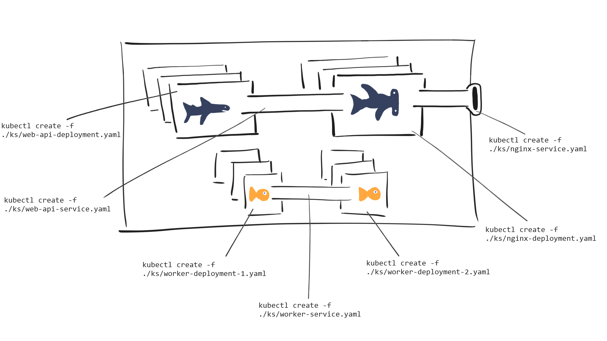
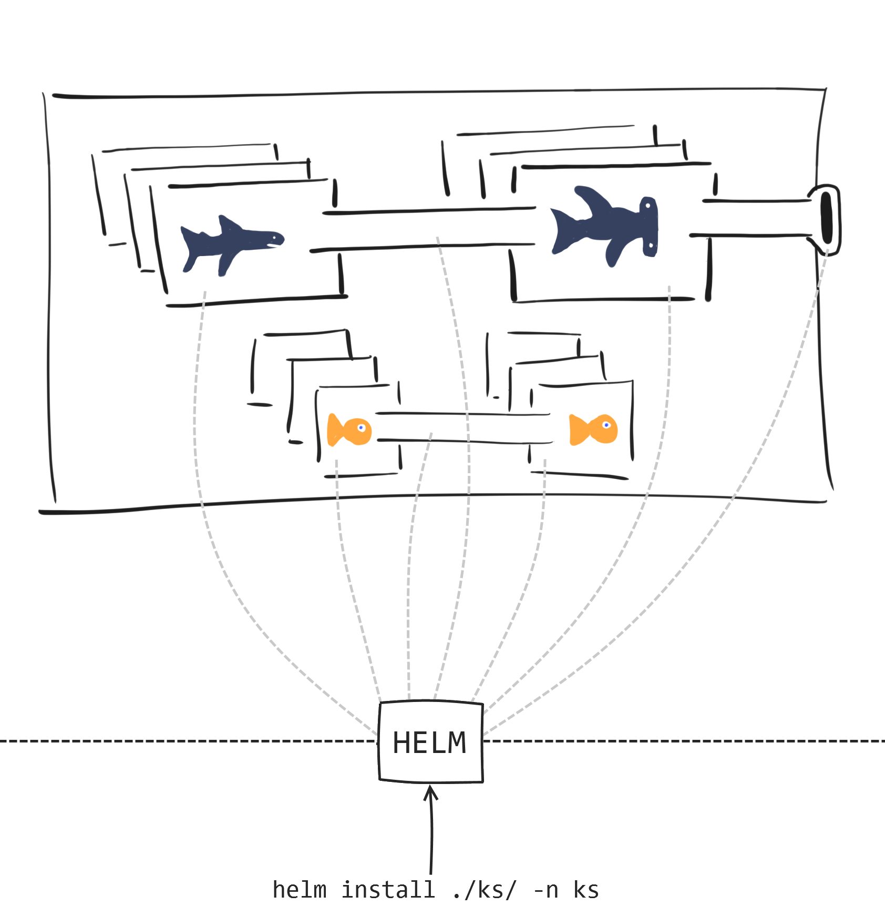

# Deploying Kubernetes applications with Helm

In our [first Kubernetes blog post](https://medium.com/ingeniouslysimple/adopting-kubernetes-step-by-step-f93093c13dfe), we discussed what Kubernetes has to offer and why you might want to use it.

To go with that blog, we started a [series of walk-throughs on github](https://github.com/red-gate/ks) on how to build an application using Kubernetes.

We've just released [the latest walk-through](https://github.com/red-gate/ks/blob/master/ks5/ks5.md) in this series, which discusses deploying an application using [Helm](https://github.com/kubernetes/helm). This post is going to talk about why we chose to use Helm. It references the previous walk-throughs in the Kubernetes series, so if you haven't read them yet it might not make sense. (Click [here](https://github.com/red-gate/ks) to check them out!)

## Motivation

In the first four walk-throughs in our Kubernetes series, we were deploying our application using the `kubectl` command line application.

This involved running a command like `kubectl create -f ./<k8s-resource-file>.yaml` for each Kubernetes resource that formed part of our application.

Altough this worked, it was painful because we had to run a command for each resource in our Kubernetes application. This is prone to error, because we might forget to deploy one resource, or introduce a typo when writing our `kubectl` commands. As our application scales up and becomes bigger, the probability of these problems occurring increases.

You could avoid this by writing an automation script, but if you change the filenames or paths of your Kubernetes resources, then you need to update the script too.

Alternatively, you could bundle all your Kubernetes resources into one YAML file, separating each resource with a document separator (three hyphens: `---`). This isn't ideal either, because now your source control history for each Kubernetes resource config is merged into one file.

The real problem is that _**we**_ have to remember _**exactly**_ how to deploy the application _**step by step**_. Our "application" (i.e, all of our Kubernetes resources packaged together) is something kubectl has no idea about.

```bash
# Deploying an application to a cluster using kubectl...
> kubectl create -f ./ks/web-api-deployment.yaml
> kubectl create -f ./ks/web-api-service.yaml
> kubectl create -f ./ks/nginx-deployment.yaml
> kubectl create -f ./ks/nginx-service.yaml
> kubectl create -f ./ks/worker-deployment-1.yaml
> kubectl create -f ./ks/worker-deployment-2.yaml
> kubectl create -f ./ks/worker-service.yaml
```

## Helm to the rescue

Helm offers a solution to this problem. According to the documentation:

> [Helm is a tool for managing Kubernetes charts. Charts are packages of pre-configured Kubernetes resources.](https://github.com/kubernetes/helm#kubernetes-helm)

> [A chart is organized as a collection of files inside of a directory.](https://github.com/kubernetes/helm/blob/master/docs/charts.md#the-chart-file-structure)

In other words, Helm allows us to work from the mental model of managing our "application" on our cluster, instead of individual Kubernetes resources via `kubectl`.

## How does it compare?

Suppose our Kubernetes application has the following resources (we won't worry about any implementation details right now):

- Web API server (`web-api-deployment.yaml`)
- Nginx for static files & reverse proxy to Web API (`nginx-deployment.yaml`)
- Web API server internal service for Nginx to proxy to (`web-api-service.yaml`)
- External service to expose Nginx (`nginx-service.yaml`)
- Worker process 1 (`worker-deployment-1.yaml`)
- Worker process 2 (`worker-deployment-2.yaml`)
- Worker service, connecting the two workers (`worker-service.yaml`)

Let's think about how we were deploying using the `kubectl` command line.



Notice how for each resource, we have to run a manual `kubectl` command?

Compare that to deploying with helm...



There's only one command - helm knows which resources need to be deployed and does it all for us.

## Okay, Helm saves me a few command line calls... so what?

While using helm _does_ save you a few command line calls, one of the big wins is that you now get to work from a mental model of managing an _application_ on a kubernetes cluster. 

And helm offers more than that, too.

### Revision management

Helm keeps track of how many times an application has been deployed on a cluster. You can inspect what revision number you're currently at, and you can even rollback to previous revisions if necessary. Doing this with `kubectl` is possible, but it's much more difficult than just running `helm rollback <APPLICATION> <REVISION_NUMBER>`.

### Updates made easy

Helm also handles any updates you want to make to your cluster.

Maybe you've made changes to both the Web API server and the worker. You've got a new docker image for both of these resources and want to deploy the change.

With helm, all you have to do is the following after updating the docker image version you want to use:

```bash
helm upgrade <release-name> <chart-directory>
```

Helm does the hard work for you and figures out what has changed and what needs to be deployed. In this case, it notices the desired state of the cluster has a newer image version for the Web API server and worker. Helm therefore starts spinning up new pods with the specified docker image and terminates the other pods once the new ones are up and ready.

No need for you to use `kubectl set image` or `kubectl patch` for each individual resource - just deploy your application as a unit with all of your changes in one operation.

## So how do I get started?

You can check out our Kubernetes series on [github](https://github.com/red-gate/ks/). We've just released a [new walk-through](https://github.com/red-gate/ks/blob/master/ks5/ks5.md) on how to migrate an application from using `kubectl` to helm. There's [another walk-through](https://github.com/red-gate/ks/blob/master/ks6/ks6.md) there too, which is about how to leverage helm to create multiple different environments (e.g, dev/test/staging/production). 

You can also check out the official [helm documentation](https://docs.helm.sh/).

## What's next?

In the next walk-throughs, we're going to be looking at how we add a database to our cluster. This is an interesting topic, because most of the time containers are allowed to be killed and brought back up without warning. This is a problem for databases, because they are inherently stateful - if a container goes down for some reason, it is _not_ ok for the data to be lost with it. That has to persist outside of the container lifecycle itself. 

Keep an eye out for the next tutorials on how we add a database to our cluster. We'll also be looking into dev-ops practices for how you can manage schema migrations, backups, and other tasks.