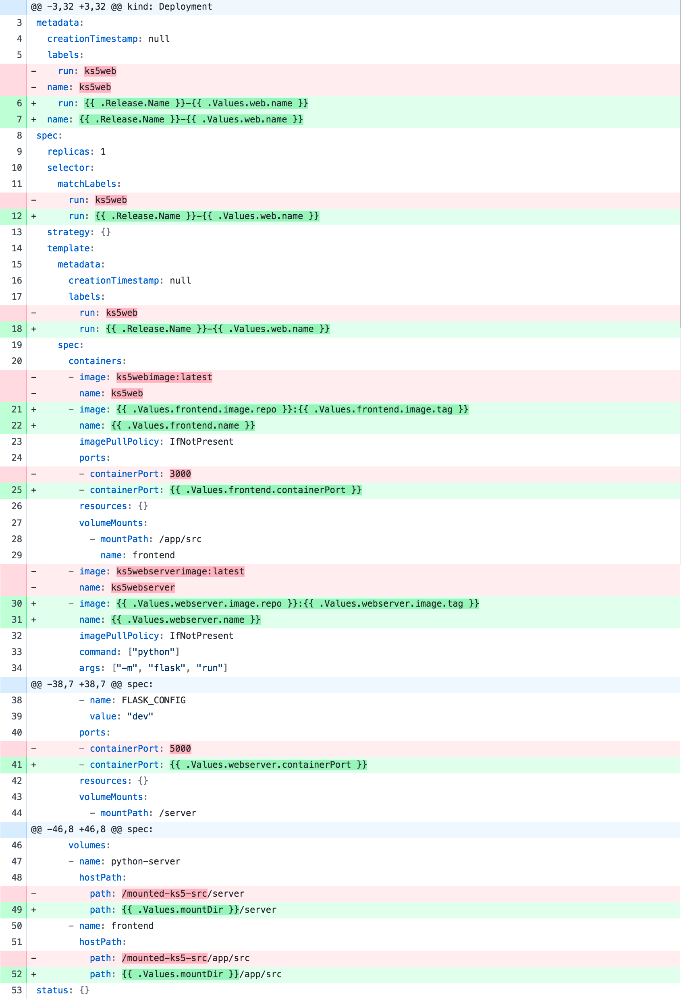
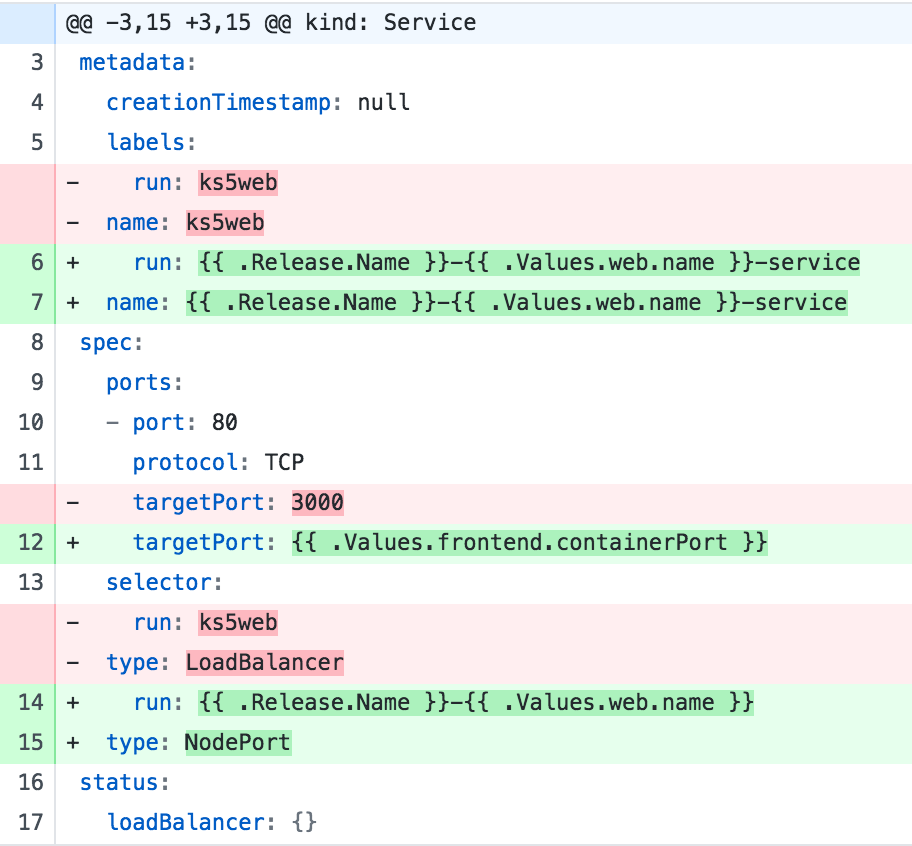

# Kubernetes series part 6

The objective here is to create a Helm "chart" for our Kubernetes application. This will allow us to treat all of our Kubernetes resources as a single package and avoid using `kubectl` to manually deploy individual resources step by step.

Helm also makes it easier to create different environments (dev/test/prod) which we will see the benefit of in later tutorials.

## Motivation

In all the previous walkthroughs, we deployed our Kubernetes app using the `kubectl` command line application. This was painful because we had to remember to create the deployment and the service each time we wanted to release a new version of our app. If we created any more Kubernetes resources, then we'd have to remember to manually deploy those each time too.

On top of that, we also had to remember the exact file names of our Kubernetes manifest files. If we've built some automation around this, then we'd need to update our scripts each time we made any changes to filenames.

The problem is that _**we**_ have to remember exactly how to deploy the application step by step. Our "application" (i.e, _all_ of our Kubernetes resources packaged together) is something `kubectl` has no idea about.

## Helm

[Helm](https://github.com/kubernetes/helm) is one of the solutions to this problem. According to the documentation:

> [Helm is a tool for managing Kubernetes charts. Charts are packages of pre-configured Kubernetes resources.](https://github.com/kubernetes/helm#kubernetes-helm)

> [A chart is organized as a collection of files inside of a directory.](https://github.com/kubernetes/helm/blob/master/docs/charts.md#the-chart-file-structure)

In other words, Helm allows us to work from the mental model of managing our "application" on our cluster, instead of individual Kubernetes resources via `kubectl`.

One of the other features of Helm is its ability to use _templates_ in Kubernetes resources that are part of the chart. This means you can define values in one place and share them across multiple Kubernetes resource files. We'll also make use of this functonality as part of this walk-through.

## Charting a course to Helm

In this walk-through, we'll turn our Kubernetes application into a helm "chart". This will let us deploy and update our entire application (all of the Kubernetes resources) using a single command line call to helm. We also won't even touch `kubectl` during deployment.

### Getting Helm up and running

Make sure you've got helm installed already. Follow the [Installing Helm](https://docs.helm.sh/using_helm/#installing-helm) documentation to do this.

Once you have Helm installed, the next thing is to initialize the command line and get it running in your cluster.

```bash
➜ helm init
```

### Creating the chart

1. Create the ks6 directory

    ```bash
    ➜ pwd
     ~/dev/github/redgate/ks/
    ➜ mkdir ks6
    ➜ cp -r ./ks5/ ./ks6/
    ➜ cd ks6
    ```

1. Create our new chart

    ```bash
    ➜ pwd
     ~/dev/github/redgate/ks/ks6/

    ➜ helm create ks
    Creating ks
    ```

1. Inspect the chart directory

    ```bash
    ➜ pwd
     ~/dev/github/redgate/ks/ks6/

    ➜ tree ks
    ks
    ├── Chart.yaml
    ├── charts
    ├── templates
    │   ├── NOTES.txt
    │   ├── _helpers.tpl
    │   ├── deployment.yaml
    │   ├── ingress.yaml
    │   └── service.yaml
    └── values.yaml

    2 directories, 7 files
    ```

    Note that helm has created some default Kubernetes resources for us. We want to use our existing resources, so we won't be using the yaml files that have been created for us.

1. Delete the default files

    ```bash
    ➜ pwd
     ~/dev/github/redgate/ks/ks6/

    ➜ rm ks/templates/*.yaml

    # Delete the contents of NOTES.txt
    ➜ > ks/templates/NOTES.txt

    ➜ tree ks
    ks
    ├── Chart.yaml
    ├── charts
    ├── templates
    │   ├── NOTES.txt
    │   └── _helpers.tpl
    └── values.yaml

    2 directories, 4 files
    ```

1. Copy our old **development** resources into the helm chart templates directory

    ```bash
    ➜ pwd
     ~/dev/github/redgate/ks/ks6/

    ➜ cp ../ks6/config/dev.* ./ks/templates/

    ➜ tree ks
    ks/
    ├── Chart.yaml
    ├── charts
    ├── templates
    │   ├── NOTES.txt
    │   ├── _helpers.tpl
    │   ├── dev.ks.deployment.yaml
    │   └── dev.ks.service.yaml
    └── values.yaml

    2 directories, 6 files
    ```

1. Tidy up unneeded resources

    ```bash
    ➜ pwd
     ~/dev/github/redgate/ks/ks6/

    ➜ rm -rf ./config
    ➜ rm -rf ./scripts
    ```

    At this point, we could deploy our helm chart. However, we'll first make use of Helm's _template_ feature.

### Using templates in the chart

Helm creates some values in `values.yaml` that were used in the default resources we just deleted.
We don't want to use any of these values, so we'll define our own. Replace the contents of `values.yaml` with:

```yaml
web:
    name: ks6web

mountDir: /mounted-ks6-src

frontend:
    name: ks6webfrontend
    image:
        repo: ks6webimage
        tag: latest
    containerPort: 3000

webserver:
    name: ks6webserver
    image:
        repo: ks6webserverimage
        tag: latest
    containerPort: 5000
```

We'll now modify our Kubernetes resource files to refer to these values.

### Helm template syntax

First, a quick explanation of the syntax:

`.Release.Name` refers to the name of the _helm release_. This is a string you define when you first deploy your helm chart and stays the same through upgrades.

`.Values.web.name` is a reference to the `name` value under the `web` data structure at the root of our `values.yaml` file.
Whenever you want to refer to a variable in the `values.yaml` file, you must start with `.Values`. You can then pull values out of the data structures you have defined using the dot syntax.

### Updating the resources from `values.yaml`

#### `dev.ks.deployment.yaml`



#### `dev.ks.service.yaml`



## Deploying the chart

At this point, you're ready to deploy the Kubernetes chart.

In one terminal, leave this running:

```bash
➜ pwd
    ~/dev/github/redgate/ks/ks6/
➜ minikube mount .:/mounted-ks6-src
```

In another terminal:

```bash
➜ pwd
    ~/dev/github/redgate/ks/ks6/
➜ cd app
➜ yarn
➜ yarn build
➜ cd ..
➜ eval $(minikube docker-env)
➜ docker build -f ./server/Dockerfile -t ks6webserverimage .
➜ docker build -f ./web/Dockerfile -t ks6webimage .
➜ helm install ./ks/ -n ks

NAME:   ks
LAST DEPLOYED: Thu Jan 11 16:03:29 2018
NAMESPACE: default
STATUS: DEPLOYED

RESOURCES:
==> v1/Service
NAME            TYPE          CLUSTER-IP  EXTERNAL-IP  PORT(S)       AGE
ks6web-service  LoadBalancer  10.0.0.173  <pending>    80:31316/TCP  0s

==> v1beta1/Deployment
NAME    DESIRED  CURRENT  UP-TO-DATE  AVAILABLE  AGE
ks6web  1        1        1           0          0s

==> v1/Pod(related)
NAME                     READY  STATUS             RESTARTS  AGE
ks6web-76588bdd75-r6226  0/2    ContainerCreating  0         0s
```

Your app is now up and running.

## What's next

One thing you'll notice is we've only moved our development environment into helm. A next step would be to leverage the `values.yaml` file by offering a configurable "environment" variable. By testing the value of "environment" you can enable or disable parts of the Kubernetes resource configuration file, appropriate to the environment you're deploying to.

In future walk-throughs, we'll be exploring this idea.