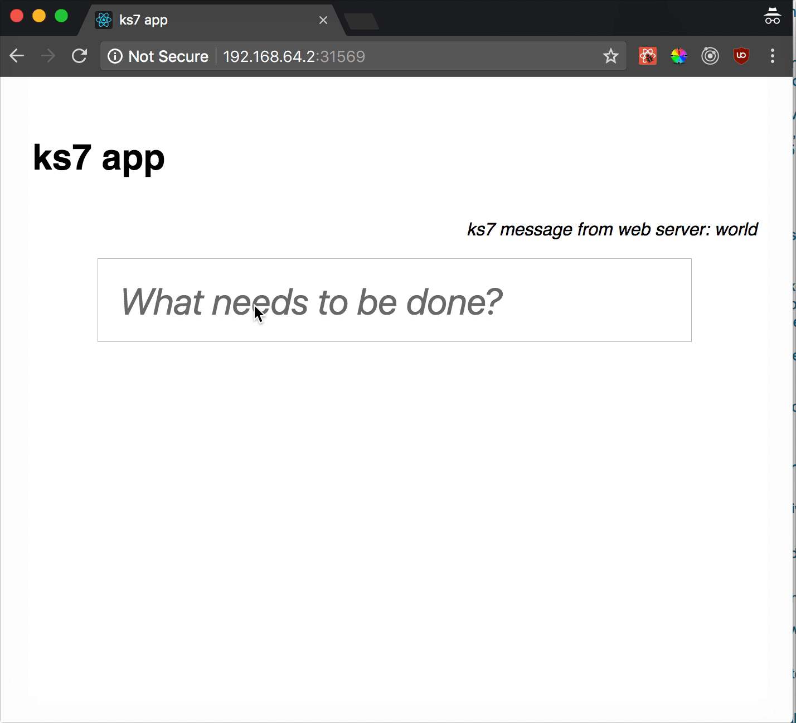

# Kubernetes series part 7

ks7 is setting up the foundation for the next couple of episodes. Where we are going to start working with data and databases. This episode does not need any kubernetes changes, only code changes.

We are going to modify our backend and frontend code so that we can have a Todo application that stores data in memory. This will lay the groundwork for the next episodes.



To test or develop against ks7 go to section [Set up and start ks7](#set-up-and-start-ks7)

## Code changes

1. Create a Todo list API in the backend server

    We start by creating a simple API for Todo list operations:

    Define the following url rules in our python server `server/server.py`

    ```python
    app.add_url_rule('/api/todo/list', view_func=controller_todo.list_items, methods=['GET'])
    app.add_url_rule('/api/todo/add', view_func=controller_todo.add, methods=['POST'])
    app.add_url_rule('/api/todo/delete', view_func=controller_todo.delete, methods=['POST'])
    app.add_url_rule('/api/todo/item/update', view_func=controller_todo.item_update, methods=['POST'])
    ```

    And we create a todo.py file in the `server/controllers` folder with the code for the API actions defined:

    `todo.py` code:

    ```py
    # in memory todo list storage
    todo_list = []

    def list_items():
        'GET todo list'
        current_app.logger.info('todo controller called, func: list')
        return jsonify({
            'todoList': todo_list
        })

    def add():
        'POST add item into todo list'
        current_app.logger.info('todo controller called, func: add')

        data = json.loads(request.data.decode("utf-8"))
        item = data['newItem']

        todo_list.append(item)

        return jsonify({
            'todoList': todo_list
        })

    def delete():
        'POST delete item from list'
        current_app.logger.info('todo controller called, func: delete')

        data = json.loads(request.data.decode("utf-8"))
        item = data['itemToDelete']

        if item in todo_list:
            todo_list.remove(item)

        return jsonify({
            'todoList': todo_list
        })

    def item_update():
        'POST update item in list'
        current_app.logger.info('todo controller called, func: item_update')

        data = json.loads(request.data.decode('utf-8'))
        item = data['itemToUpdate']

        results = [x for x in todo_list if x['id'] == item['id']]

        if results:
            current_app.logger.info('found results')
            index = todo_list.index(results[0])
            todo_list[index] = item

        return jsonify({
            'todoList': todo_list
        })
    ```

    Notice that the `todo_list` is a python list defined as a global constant. __This is not a good practice__ but it allows us create our todo list app without caring about how we are going to store things at the moment.

    In the next ks episode we will care about the right way to do this and modify the `server/controllers/todo.py` accordingly.

1. create a `<AddTask>` component in the frontend

    The `<AddTask>` component's responsibility is to allow user to submit a new task into the todo list.

    ```jsx
    export class AddTask extends Component {

    constructor(props) {
        super(props)
        this.addTaskSubmit = this.addTaskSubmit.bind(this)
    }

    addTaskSubmit(e) {
        e.preventDefault()
        this.props.onTaskAdded(e.target.name.value)
        e.target.name.value = ''
    }

    render() {
        return <div className='add-task'>
        <form onSubmit={this.addTaskSubmit}>
            <input
            className='add-task-name'
            type='text'
            name='name'
            placeholder='What needs to be done?'
            size="30"
            />
        </form>
        </div>
    }
    }
    ```

1. Create a `<TodoList>` component

    The `<TodoList>` component's responsibility is to display the todo list as well as allowing the user perform the following actions

    - remove an item from the list
    - update an item from the list

    ```jsx
    export class TodoList extends Component {

    deleteTaskClick(itemId){
        this.props.onTaskDeleted(itemId)
    }

    updateItemClick(item){
        this.props.onTaskUpdate(item)
    }

    render() {
        return <div className='tasks'>
        {this.props.items.map(item => 
            <div className='task-item' key={'item-' + item.id}>
            <div className='task-item-tick' title='click to do or undo a task' onClick={() => this.updateItemClick(item)}>{item.done? '☑': '☐'}</div>
            <div className='task-item-name'>{item.name}</div>
            <div className='task-item-delete' title='click to remove a task from your list' onClick={() => this.deleteTaskClick(item.id)}>x</div>
            </div>
        )}
        </div>
    }
    }
    ```

1. Use `<AddTask>` and `<TodoList>` in `<App>` render

    Our `<App>` render function will look like this

    ```jsx
    render() {
        return <div className='App'>
        <header className='App-header'>
            <h1 className='App-title'>ks7 app</h1>
        </header>
        <p className='App-intro'>
            ks7 message from web server: {this.state.message}
        </p>
        <AddTask onTaskAdded={this.onTaskAdded} />
        <TodoList
            items={this.state.todoItems}
            onTaskUpdate={this.onTaskUpdate}
            onTaskDeleted={this.onTaskDeleted}/>
        </div>
    }
    ```

1. Fetch current items

    For our app to display the items we first need to fetch them at the start of the `App` component lifecycle.
    To do that we call our backend server on `/api/todo/list` in the `App` constructor.

    ```jsx
    class App extends Component {

    constructor(props) {
        super(props)
        this.state = {
        message: 'moon',
        todoItems: []
        }
        // ...
        this.fetchTodoItems()
    }

    fetchTodoItems(){
        fetch('/api/todo/list', {
        'Content': 'GET',
        headers: {
            'Content-Type': 'application/json'
        }
        }).then(response => {
        return response.json()
        }).then(json => {
        this.setState({ todoItems: json.todoList})
        })
    }
    ```

1. handle `onTaskAdded`

    To do that we bind onTaskAdded in the constructor

    ```jsx
    this.onTaskAdded = this.onTaskAdded.bind(this)
    ```

    And call the API `/api/todo/add`.

    ```jsx
    onTaskAdded(taskName) {
        const newItem = {
            name: taskName,
            done: false,
            id: Date.now()
        }

        const payload = { newItem }

        fetch('/api/todo/add', {
            method: 'POST',
            headers: {
            'Content-Type': 'application/json'
            },
            body: JSON.stringify(payload),
        }).then(response => {
            return response.json()
        }).then(json => {
            this.setState({ todoItems: json.todoList})
        })
    }
    ```

1. handle `onTaskUpdate`

    Bind the function in the constructor:

    ```jsx
    this.onTaskUpdate = this.onTaskUpdate.bind(this)
    ```

    Call the todo API on update `/api/todo/item/update`

    ```jsx
    onTaskUpdate(item){
        const itemToUpdate = this.state.todoItems.find(x => x.id === item.id)
        const copyItem = {...itemToUpdate}
        copyItem.done = !copyItem.done
        const payload = { itemToUpdate: copyItem }

        !!itemToUpdate && fetch('/api/todo/item/update', {
            method: 'POST',
            headers: {
            'Content-Type': 'application/json'
            },
            body: JSON.stringify(payload)
        }).then(response => {
            return response.json()
        }).then(json => {
            this.setState({ todoItems: json.todoList})
        })
    }
    ```

1. Handle `onTaskDelete`

    Bind the function in the constructor

    ```jsx
    this.onTaskDeleted = this.onTaskDeleted.bind(this)
    ```

    Call the todo API update `/api/todo/item/delete`

    ```jsx
    onTaskDeleted(taskId) {
        const itemToDelete = this.state.todoItems.find(x => x.id === taskId)
        const payload = { itemToDelete }
        !!itemToDelete && fetch('/api/todo/delete', {
            method: 'POST',
            headers: {
            'Content-Type': 'application/json'
            },
            body: JSON.stringify(payload)
        }).then(response => {
            return response.json()
        }).then(json => {
            this.setState({ todoItems: json.todoList})
        })
    }
    ```

## Set up and start ks7

1. start minikube and build docker images

    ```bash
    ➜ cd ks7
    ➜ minikube start
    ➜ eval $(minikube docker-env)
    ➜ docker build -f ./server/Dockerfile -t ks7webserverimage .
    ➜ docker build -f ./web/Dockerfile -t ks7webimage .
    ```

1. mount volume

    ```bash
    ➜ cd ks7
    ➜ minikube mount .:/mounted-ks7-src
    ```

1. install helm chart

    ```bash
    ➜ helm install ./ks -n ks
    ```

1. check app is working properly

    ```bash
    ➜ kubectl get pods
    NAME                         READY     STATUS    RESTARTS   AGE
    ks-ks7web-7444588647-j8tmb   2/2       Running   0          30s
    ```

1. check logs

    ```bash
    ➜ kubectl logs ks-ks7web-7444588647-j8tmb ks7webfrontend
    ➜ kubectl logs ks-ks7web-7444588647-j8tmb ks7webserver
    ```

1. test app in browser

    ```bash
    ➜ minikube service ks-ks7web-service
    ```